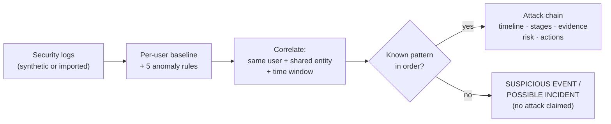

# CyberTrace AI — From Isolated Events to Explainable Attack Intelligence


**HackNex 2026 Internal Qualifier · Problem HNX26PSI03 — AI-Powered Cyber Threat Intelligence**

**Team HNX-INT-035 "SkillIssue"**

Security systems collect millions of logs. Each one looks normal on its own, but together they can
reveal a coordinated attack. **CyberTrace AI connects events across users, devices, IP addresses,
applications, resources and USB devices, and reconstructs what an attacker did, step by step.** For
every attack it outputs:

| Required output | What CyberTrace shows |
|---|---|
| Timeline of the attack | Stages ordered by the real event timestamps (09:12 → 09:16 → 09:21 → 09:23) |
| Who was involved | Users, devices, IPs, applications, resources and USB devices, plus an interactive entity graph |
| Stages of the attack | Each stage named and mapped to MITRE ATT&CK (T1078, T1005, T1200, T1052.001, T1041) |
| Proof for each stage | Evidence rows that link to stored raw events, checked by a validation pass (48/48 verified) |
| How risky it is | Deterministic 0–100 score with the full formula shown (e.g. 15 + 20 + 20 + 25 + 10 = 90, CRITICAL) |
| What to do about it | Prioritized playbook actions (IMMEDIATE / HIGH) derived from the observed stages |
| Why it's an attack | Observed facts kept strictly separate from the system's interpretation |

It also **stays quiet on clean logs**. A single unusual event is recorded but never escalated. An attack
is only claimed when several related anomalies follow a known attack pattern in the right order.


### Results at a glance

| Scenario | Input | Output |
|---|---|---|
| **Multi-stage attack** (official HackNex example) | 591 baseline events + 4 evaluated events | 1 attack chain, 4 ordered stages, 48/48 evidence rows verified, **risk 90/100 CRITICAL** |
| **Clean benign logs** (false-positive control) | 591 baseline events + 10 evaluated events | **0 attacks**, 1 isolated signal held at SUSPICIOUS EVENT, status **QUIET** |
| **Imported log file** (network exfiltration sample) | 111 events (105 baseline + 6 evaluated) | 1 attack chain via a second pattern, 3 ordered stages, **risk 70/100 HIGH** |

> All bundled data is **SYNTHETIC DEMONSTRATION DATA**. External IP addresses come from the reserved
> documentation ranges (RFC 5737) and domains use the reserved `.example` TLD.

---

## Contents

1. [Quick start](#quick-start)
2. [Screenshots](#screenshots)
3. [How it works](#how-it-works)
4. [Sample input & output](#sample-input--output)
5. [Technologies, libraries and models used](#technologies-libraries-and-models-used)
6. [Installation](#installation)
7. [Configuration](#configuration)
8. [Running the system](#running-the-system)
9. [Reproducing the demonstrated results](#reproducing-the-demonstrated-results)
10. [Using your own logs](#using-your-own-logs)
11. [Live demonstration script](#live-demonstration-script)
12. [Scope note](#scope-note)
13. [How it meets the judging criteria](#how-it-meets-the-judging-criteria)
14. [API reference](#api-reference)
15. [Project structure](#project-structure)
16. [Deployment](#deployment)
17. [Team](#team)

---

## Quick start

You only need **Python 3.10 or newer**. Node.js is **not** required: the frontend is plain HTML, CSS
and JavaScript served by the backend.

**Windows (PowerShell or cmd)**

```bash
python -m venv .venv
.\.venv\Scripts\python -m pip install -r requirements.txt
.\.venv\Scripts\python run.py
```

**macOS / Linux**

```bash
python3 -m venv .venv
./.venv/bin/python -m pip install -r requirements.txt
./.venv/bin/python run.py
```

Open **http://127.0.0.1:8001**, go to **Demo Center** and click **RUN MULTI-STAGE ATTACK DEMO**.

---

## Screenshots

| Demo Center: the two deterministic scenarios | Attack Chain: each stage with its proof |
|---|---|
|  |  |
| **Attack Timeline: built from real timestamps** | **Attack Graph: entities and observed relationships** |
|  |  |
| **Explanation: facts vs. interpretation** | **Evidence Ledger: 48/48 rows verified** |
|  |  |
| **Threat Detection: escalation ladder and risk weights** | **Clean logs: the system stays quiet** |
|  |  |

---

## How it works



Every analysis runs a **13-stage deterministic pipeline**. Each stage reports what it did, and the
full trace is shown in the UI.

1 Log Ingestion → 2 Normalization → 3 Entity Extraction → 4 Behavioral Baseline → 5 Anomaly Detection →
6 Event Correlation → 7 Sequence / Order Analysis → 8 Attack Chain Reconstruction → 9 Evidence Validation →
10 Risk Assessment → 11 Explanation → 12 Recommended Action → 13 Verdict

**1. Behavioral baseline.** For every user, CyberTrace learns from history which locations, source IPs,
devices, resources, applications, USB devices and network destinations are normal. Users with no history
are not scored, so an unfamiliar dataset cannot flood analysts with alerts.

**2. Anomaly rules.** Each rule is explainable and has a fixed weight:

| Rule | Fires when | Weight |
|---|---|---|
| Unusual Login | A successful login comes from a location, IP or device not in the user's baseline | +15 |
| Unusual Resource Access | A user reads a resource they have never accessed before | +20 |
| New USB Device | A removable device not in the user's baseline is connected | +20 |
| File Copy to Removable Media | Data is copied to a new USB device, or a never-accessed resource is copied | +25 |
| Large Transfer to New Destination | ≥ 100 MB is sent to a destination never seen for the user | +25 |
| Strong entity correlation | 3+ related anomalies match a registered pattern in order | +10 |

The score is capped at 100. Tiers: **0–29 LOW · 30–59 MEDIUM · 60–79 HIGH · 80–100 CRITICAL**.

**3. Strict correlation.** Two anomalies are *related* only if they belong to the **same user**, share
at least one **non-user entity** (device, IP, resource, application, USB device or destination), and
fall inside the **investigation window** (15, 30 or 60 minutes). Time alone never links events.

**4. Escalation ladder (false-positive control).**

| State | Requires |
|---|---|
| NORMAL | 0 anomalies |
| SUSPICIOUS EVENT | 1 isolated anomaly, recorded but never escalated |
| POSSIBLE INCIDENT | 2+ related anomalies, but no registered pattern |
| HIGH-CONFIDENCE ATTACK | 3+ related anomalies **and** a registered attack pattern observed **in the correct order** |

**5. Attack-pattern registry.** Patterns are data, not code. Adding a new multi-stage attack means
adding an entry to `backend/patterns.py`, plus a rule in `backend/engine.py` only if it needs a new
signal type.

| Pattern | Status | Ordered stages |
|---|---|---|
| Coordinated Data Exfiltration via Removable Media | active | Unusual Login (T1078) → Unusual Resource Access (T1005) → USB Connection (T1200) → File Collection / Copy (T1052.001) |
| Account Takeover with Network Exfiltration | active | Unusual Login (T1078) → Unusual Resource Access (T1005) → Exfiltration over Network (T1041) |
| Lateral Movement via Administrative Shares | roadmap | Remote Authentication → Admin Share Access → Credential Dumping |
| Slow Drip Exfiltration (low-and-slow) | roadmap | Repeated Small Uploads → Off-Hours Pattern |

**6. Proof and explanation.** Every stage carries evidence rows (field, value, source event id). Stage 9
re-checks each row against the stored events, and a chain with any unverified row is dropped. The
explanation keeps the **observed facts** separate from the **system's interpretation**. The optional
AI layer only rephrases the verified chain and never makes detection decisions.

---

## Sample input & output

### Example 1: the official multi-stage attack (Demo Center → *Run Multi-Stage Attack Demo*)

**Input:** a behavioral baseline of 591 normal events for 8 users (the previous 14 days plus the morning
of the demo day), plus these 4 evaluated events.
`user_001` normally logs in from **Chennai, IN** via `10.20.30.45` and only uses `project_files`,
`reports_2025` and `shared_drive`. Timestamps use the day you run the demo (shown here for 2026-10-07).

```json
[
  {"event_id": "EVT-00592", "timestamp": "2026-10-07T09:12:00Z", "event_type": "AUTH_LOGIN", "action": "LOGIN",
   "user": "user_001", "device": "device_07", "ip": "203.0.113.99", "location": "Singapore, SG"},
  {"event_id": "EVT-00593", "timestamp": "2026-10-07T09:16:00Z", "event_type": "FILE_ACCESS", "action": "READ",
   "user": "user_001", "device": "device_07", "ip": "203.0.113.99", "application": "file_manager",
   "resource": "confidential_project_files", "metadata": {"bytes": 48000000}},
  {"event_id": "EVT-00594", "timestamp": "2026-10-07T09:21:00Z", "event_type": "USB_CONNECT", "action": "CONNECT",
   "user": "user_001", "device": "device_07", "metadata": {"usb_device": "usb_device_03", "usb_vendor": "SanDisk"}},
  {"event_id": "EVT-00595", "timestamp": "2026-10-07T09:23:00Z", "event_type": "FILE_COPY", "action": "COPY",
   "user": "user_001", "device": "device_07", "ip": "203.0.113.99", "application": "file_manager",
   "resource": "confidential_project_files", "metadata": {"usb_device": "usb_device_03", "bytes": 2100000000, "files": 214}}
]
```

**Output: verdict**

```json
{
  "system_status": "ATTACK_DETECTED",
  "verdict_message": "HIGH-CONFIDENCE ATTACK DETECTED — 1 coordinated attack chain reconstructed from 4 correlated events (risk 90/100 CRITICAL).",
  "total_events": 595, "baseline_events": 591, "evaluated_events": 4,
  "anomalies": 4, "high_confidence_attacks": 1, "risk_score": 90, "risk_tier": "CRITICAL"
}
```

**Output: reconstructed attack chain** (pattern `DATA_EXFILTRATION_REMOVABLE_MEDIA`)

| # | Time (UTC) | Stage | MITRE | Proof (source events) | Risk |
|---|---|---|---|---|---|
| 1 | 09:12:00 | Unusual Login | T1078 | EVT-00592 (5 evidence rows) | +15 |
| 2 | 09:16:00 | Unusual Resource Access | T1005 | EVT-00593 (7 evidence rows) | +20 |
| 3 | 09:21:00 | USB Connection | T1200 | EVT-00594 (4 evidence rows) | +20 |
| 4 | 09:23:00 | File Collection / Copy | T1052.001 | EVT-00595 (8 evidence rows) | +25 |
| 5 | 09:23:00 | Coordinated Data Exfiltration *(derived interpretation)* | T1052.001 | all four events (24 rows) | +10 |

- **Involved:** `user_001` · `device_07` · `203.0.113.99` · `file_manager` · `confidential_project_files` · `usb_device_03`
- **Correlation:** *"4 related anomalies share device: device_07, ip: 203.0.113.99, user: user_001 and occur within a 11-minute span (investigation window: 30 min)."*
- **Risk:** `Unusual Login +15 + Unusual Resource Access +20 + New USB Device +20 + File Copy to Removable Media +25 + Strong entity correlation +10 = 90/100` → **CRITICAL**
- **Evidence validation:** `48/48 evidence rows verified against stored events — every stage has proof`
- **Why (interpretation, step 1 of 5):** *"User user_001 logged in from a new location 'Singapore, SG' that is not in the user's baseline (known: Chennai, IN) and source IP 203.0.113.99 was never seen for this user (known: 10.20.30.45)."*
- **Conclusion:** *"The combined evidence indicates a coordinated data-exfiltration activity."*
- **Recommended actions:**
  1. `IMMEDIATE` Suspend active sessions for the affected user and require a credential reset
  2. `HIGH` Block the source IP at the perimeter firewall and add it to watchlists
  3. `HIGH` Alert the data owner of the accessed resource and review its access control list
  4. `IMMEDIATE` Quarantine the USB device and preserve it for forensic imaging
  5. `IMMEDIATE` Isolate the affected device from the network pending EDR inspection
  6. `IMMEDIATE` Recover the copied data and verify whether it left the environment

### Example 2: clean logs (Demo Center → *Run Clean Log Demo*)

**Input:** the same 591-event baseline plus 10 benign evaluated events. These include normal logins and
file access, a routine in-baseline USB backup by the operator `user_006`, and one conference login by
`user_003` from a new city.

**Output:**

```json
{
  "system_status": "QUIET",
  "verdict_message": "NO COORDINATED ATTACK DETECTED — system remains quiet: no sufficient correlated evidence (1 isolated signal held at SUSPICIOUS EVENT).",
  "total_events": 601, "evaluated_events": 10, "anomalies": 1,
  "possible_incidents": 0, "high_confidence_attacks": 0, "risk_score": 0
}
```

The one anomaly (EVT-00594, `user_003` logging in from *Kuala Lumpur, MY* via `198.51.100.24`) stays at
**SUSPICIOUS EVENT** because nothing related follows it. The 3.4 GB USB backup raises **no anomaly at
all**, because that device and archive are part of the operator's normal behavior.

### Example 3: importing a log file (Log Explorer → *Import your own logs*)

**Input:** [`frontend/samples/network_exfiltration_logs.json`](frontend/samples/network_exfiltration_logs.json).
It contains 111 events for 3 users: 105 rows flagged `"baseline": true`, plus 6 new events.

```bash
curl -F "file=@frontend/samples/network_exfiltration_logs.json" -F "mode=replace" http://127.0.0.1:8001/api/events/upload
```

**Output:** 3 anomalies → 1 chain using the **second** registered pattern:

| # | Time (UTC) | Stage | MITRE | Proof |
|---|---|---|---|---|
| 1 | 14:01 | Unusual Login (`j.smith` from Frankfurt, DE · 192.0.2.77) | T1078 | EVT-00107 |
| 2 | 14:06 | Unusual Resource Access (`customer_pii_export`, 1.9 GB) | T1005 | EVT-00109 |
| 3 | 14:13 | Exfiltration over Network (1.8 GB to `transfer.anonfiles.example`) | T1041 | EVT-00110 |

`Unusual Login +15 + Unusual Resource Access +20 + Large Transfer to New Destination +25 + Strong entity correlation +10 = 70/100` → **HIGH**.
The two other users' events in the same file raise nothing.

---

## Technologies, libraries and models used

| Layer | Technology | Purpose |
|---|---|---|
| Language | **Python 3.10+** (developed and tested on 3.14) | Backend and detection engine |
| Web framework | **FastAPI** (with Pydantic validation) | REST API; also serves the frontend |
| ASGI server | **Uvicorn** | Runs the app |
| File uploads | **python-multipart** | Multipart log-file import |
| Storage | **SQLite** via Python's built-in `sqlite3` | Zero-setup persistence (`data/cybertrace.db`) |
| Detection engine | **Pure Python standard library** | Baselines, rules, correlation, pattern matching, scoring |
| Frontend | **HTML5, CSS3, vanilla JavaScript (ES modules), inline SVG** | 10-page single-page app with no framework, no npm and no build step |
| Fonts / icons | Google Fonts (Geist, JetBrains Mono); Lucide-style inline SVG icons | UI (falls back to system fonts offline) |
| Optional AI | **Google Gemini API** (`gemini-2.5-flash` by default, REST via `urllib`) | Rephrases the verified chain into an analyst narrative |
| Testing | **pytest** + **httpx** (FastAPI `TestClient`) | 15 end-to-end tests |
| Deployment | Docker, Render (`render.yaml`), Procfile | Hosting options |

**Models.** No machine-learning model is trained or required, and no external dataset is downloaded.
Detection is an explainable, deterministic engine made of:

- per-user **behavioral baselining**, learned from historical events
- a registry of explainable **anomaly rules**
- **entity-graph correlation**: union-find over anomalies that share a user and an entity within the time window
- **ordered pattern matching** against a MITRE ATT&CK-mapped registry
- **additive risk scoring** with published weights

The only model is the **optional** LLM (Gemini). It receives the already-verified chain as JSON and
only rewrites the narrative. Without an API key, or on any error or timeout, the built-in deterministic
narrative is used and the app works exactly the same.

---

## Installation

**Prerequisites:** Python 3.10 or newer, and Git. Internet access is needed only for `pip install`
and, optionally, the Google Fonts and Gemini API.

1. Clone or download this repository and open a terminal in the project folder (the one containing `run.py`).
2. Create a virtual environment and install the dependencies:

   **Windows**
   ```bash
   python -m venv .venv
   .\.venv\Scripts\python -m pip install -r requirements-dev.txt
   ```
   **macOS / Linux**
   ```bash
   python3 -m venv .venv
   ./.venv/bin/python -m pip install -r requirements-dev.txt
   ```
   `requirements.txt` lists the runtime packages: `fastapi`, `uvicorn[standard]` and `python-multipart`.
   `requirements-dev.txt` adds `pytest` and `httpx` for the test suite.

**VS Code:** open the folder, install the recommended **Python** extensions when prompted, then run
**Terminal → Run Task → "Setup: create venv + install"**.

---

## Configuration

Everything works with the defaults; no configuration is required. Optional settings are read from
**environment variables** (see `.env.example`).

| Variable | Default | Purpose |
|---|---|---|
| `HOST` | `127.0.0.1` | Bind address. Use `0.0.0.0` to expose on a network or in a container |
| `PORT` | `8001` | HTTP port |
| `GEMINI_API_KEY` | *(empty)* | Turns on the optional AI narrative |
| `GEMINI_MODEL` | `gemini-2.5-flash` | Gemini model name |
| `GEMINI_TIMEOUT_S` | `8` | Seconds before falling back to the deterministic narrative |
| `CYBERTRACE_DATA_DIR` | `./data` | Folder for the SQLite database |
| `CYBERTRACE_DB` | `./data/cybertrace.db` | Explicit database file path |
| `CYBERTRACE_EVAL_HOURS` | `24` | For imported logs without baseline rows: how many recent hours are evaluated |
| `CORS_ORIGINS` | `*` | Only needed if the frontend is hosted on a different origin |

Example: enable the AI narrative and use port 9000.

**Windows PowerShell**
```powershell
$env:GEMINI_API_KEY = "your-key"; $env:PORT = "9000"; .\.venv\Scripts\python run.py
```
**macOS / Linux**
```bash
GEMINI_API_KEY=your-key PORT=9000 ./.venv/bin/python run.py
```

The **investigation window** (15 / 30 / 60 minutes) is chosen in the UI on the Demo Center and Threat
Detection pages. The API accepts any value from 5 to 240 minutes.

---

## Running the system

**Windows**
```bash
.\.venv\Scripts\python run.py
```
**macOS / Linux**
```bash
./.venv/bin/python run.py
```

Then open **http://127.0.0.1:8001**. Interactive API docs (Swagger) are at **http://127.0.0.1:8001/docs**.

From **VS Code**, press **F5** and choose **"CyberTrace AI (server)"**, or run the task **"Run CyberTrace AI"**.
`python run.py --reload` restarts automatically when backend code changes.

To start from an empty state, run `curl -X POST http://127.0.0.1:8001/api/reset`, or stop the server
and delete the `data/` folder.

---

## Reproducing the demonstrated results

The synthetic datasets are **deterministic** (fixed seed 2026). The same events, event ids and scores
are produced on every machine and every day. Only the calendar date of the timestamps changes.

### Option A: in the browser

| Step | Action | Expected result |
|---|---|---|
| 1 | **Demo Center → RUN MULTI-STAGE ATTACK DEMO** | Red banner *HIGH-CONFIDENCE ATTACK DETECTED*, **risk 90/100 (CRITICAL)**; 595 events, 4 anomalies, 1 attack |
| 2 | **Attack Timeline** | 09:12:00 → 09:16:00 → 09:21:00 → 09:23:00, events EVT-00592 … EVT-00595 |
| 3 | **Evidence** | 48 evidence rows, 4 distinct source events, *48/48 evidence rows verified* |
| 4 | **Attack Graph** → click the stage buttons | The chain grows stage by stage: `user_001` → `203.0.113.99` → `confidential_project_files` → `usb_device_03` |
| 5 | **Threat Detection** → window 15 or 60 min → *Re-run analysis* | Same chain and score (the attack spans 11 minutes) |
| 6 | **Demo Center → RUN CLEAN LOG DEMO** | Green banner *NO COORDINATED ATTACK DETECTED*; 601 events, 1 isolated signal, 0 attacks |
| 7 | **Log Explorer** → download *sample: network exfiltration* → import with **Replace** | *111 events imported (0 rejected) · 3 anomalies · 1 attack chain(s)*; Attack Chain shows **70/100 HIGH** |
| 8 | **Log Explorer** → download *CSV template* → import with **Replace** | 9 events, 4 anomalies, 1 chain for `r.patel` (22:47 → 22:58), **90/100 CRITICAL** |

### Option B: through the API

Run these from the project folder while the server is running. On Windows PowerShell, type `curl.exe`
instead of `curl`.

```bash
curl -X POST http://127.0.0.1:8001/api/demo/attack
curl http://127.0.0.1:8001/api/stats
curl http://127.0.0.1:8001/api/explanation/latest
curl -X POST http://127.0.0.1:8001/api/demo/clean
curl -F "file=@frontend/samples/network_exfiltration_logs.json" -F "mode=replace" http://127.0.0.1:8001/api/events/upload
```

What each command returns:

1. The full attack analysis JSON: chain, stages, evidence and risk.
2. The dashboard summary: `"system_status": "ATTACK_DETECTED"`, `"risk_score": 90`.
3. The explanation: facts, interpretation and recommendations.
4. The clean analysis: `"system_status": "QUIET"`, `"high_confidence_attacks": 0`.
5. The import result: `"ingested": 111`, `"high_confidence_attacks": 1`, `"risk_score": 70`.

### Option C: automated tests

**Windows**
```bash
.\.venv\Scripts\python -m pytest -q
```
**macOS / Linux**
```bash
./.venv/bin/python -m pytest -q
```

Expected: **`15 passed`**. The tests check:

- correct stage order and timestamps for 15, 30 and 60-minute windows
- that every evidence row resolves to a stored event
- that clean logs stay quiet with exactly one isolated signal
- the entity graph contents
- that the explanation keeps facts and interpretation separate
- that both sample files produce the expected chains
- input validation, and that the dataset is identical on any calendar day

---

## Using your own logs

**Log Explorer → Import your own logs** (or `POST /api/events/upload`) accepts a **JSON array**,
**JSON Lines** or **CSV** file (max 10 MB / 50,000 events).

| Field | Required | Notes |
|---|---|---|
| `timestamp` | yes | ISO-8601; treated as UTC when no timezone is given |
| `event_type` | yes | `AUTH_LOGIN`, `FILE_ACCESS`, `USB_CONNECT`, `FILE_COPY`, `NETWORK_CONNECTION`, `APP_USAGE`. Aliases such as `login`, `logon`, `usb`, `copy`, `upload` are mapped automatically |
| `user`, `device`, `ip`, `application`, `resource`, `action`, `location` | no | Aliases such as `username`, `host`, `src_ip`, `app`, `file` are accepted |
| `usb_device`, `destination`, `bytes` | no | Needed for the USB, copy and network-exfiltration rules |
| `baseline` | no | `true` makes the row part of the behavioral baseline |

Any other columns are kept in the event's `metadata`.

- **Append** (default): new events are evaluated against the current baseline.
- **Replace**: the store is cleared first. Rows marked `baseline: true` form the baseline. If no rows are
  marked, the last 24 hours are evaluated against everything earlier.

See [`frontend/samples/custom_logs_template.csv`](frontend/samples/custom_logs_template.csv) for a
ready-to-edit example.

---

## Live demonstration script

A suggested 3-minute walkthrough for the evaluation:

1. **Dashboard:** explain the goal of turning isolated events into one evidence-backed attack story.
2. **Demo Center → Run Multi-Stage Attack Demo:** the 13 pipeline stages light up and a CRITICAL alert appears.
3. **Attack Timeline:** four ordered steps. Click **Evidence: EVT-00592** to open the raw log event.
4. **Attack Graph:** step through STAGE 1 → 5, then click `user_001` to trace its source events.
5. **Evidence:** 48/48 proof rows verified. Click **Export case JSON**.
6. **Explanation:** hard facts on the left, interpretation on the right, then conclusion, risk formula and actions.
7. **Demo Center → Run Clean Log Demo:** the system stays quiet. **Threat Detection** shows the single
   isolated signal held at SUSPICIOUS EVENT.
8. *(Optional)* **Log Explorer:** import the network-exfiltration sample to show a second attack type being detected.

---

## Scope note

### Minimum viable solution (required by HNX26PSI03), implemented

- ✅ Sample security logs: a deterministic simulator for 8 users over 14+ days (591 baseline events) plus attack and clean scenarios
- ✅ Event normalization and entity extraction across users, devices, IPs, applications, resources and USB devices
- ✅ Per-user behavioral baseline and explainable anomaly rules
- ✅ Correlation of separate events into **one attack chain in the right order** (the official example: unusual login → unusual file access → USB connected → copy to USB)
- ✅ For every attack: timeline, involved entities, stages, **proof for each stage**, risk score, recommended actions and an explanation of *why*
- ✅ False-positive control: clean logs stay quiet, and a single anomaly is never escalated

### Stretch goals, also implemented

- ✅ A **second active attack pattern** (account takeover → network exfiltration), added as a registry entry
- ✅ **Import your own logs** (JSON / JSON Lines / CSV, field aliases, baseline flag, append or replace)
- ✅ Interactive **entity graph** with a stage-by-stage scrubber and per-node event tracing
- ✅ An **evidence-validation pass** (unverifiable chains are dropped) and **case export** as JSON
- ✅ **Optional LLM narrative** (Gemini) with a deterministic fallback
- ✅ The full 13-stage pipeline trace in the UI, and an adjustable investigation window
- ✅ 15 automated tests, VS Code launch/task configuration, and Docker / Render / Procfile deployment files

### Not implemented: known limitations and future work

- ❌ **Slow, low-and-slow multi-day attacks** and **lateral movement** exist only as *roadmap* entries in the pattern registry. They need cross-day correlation windows and new rules.
- 🟡 **Never-before-seen attacks:** unknown combinations are still surfaced as SUSPICIOUS EVENT or POSSIBLE INCIDENT, but HIGH-CONFIDENCE ATTACK requires a registered pattern. This is a deliberate trade-off to keep false alarms low.
- 🟡 The baseline is *first-seen* (whether a value was ever observed), not statistical. There are no off-hours or volume-outlier rules yet.
- ❌ Validated on synthetic data only, with no DARPA or CTF dataset benchmark yet. There are no SIEM connectors or real-time streaming (analysis is batch, on demand), no user authentication, and storage is single-process SQLite.

---

## How it meets the judging criteria

| Criterion | How CyberTrace addresses it | Where to see it |
|---|---|---|
| Links separate events into one chain in the right order | Same-user + shared-entity + window correlation, then ordered pattern matching on real timestamps | Attack Chain, Attack Timeline |
| Identifies attacks without false alarms | Escalation ladder: 1 anomaly = SUSPICIOUS, 2 = POSSIBLE INCIDENT, only an ordered pattern = ATTACK | Threat Detection |
| Catches the real attacks | Every stage of both demonstrated attacks is detected (4/4 and 3/3) | Demo Center, Log Explorer import |
| Connects users, devices, IPs and apps correctly | The entity graph is built only from observed event relationships | Attack Graph |
| Stays quiet on clean, benign logs | Clean demo: 0 attacks; in-baseline USB backup raises nothing | Demo Center, Dashboard |
| Accurate timeline | Generated from stored event timestamps, never reordered by the UI | Attack Timeline |
| Explains why it is an attack | Observed facts vs. interpretation, conclusion, risk formula, narrative | Explanation |

---

## API reference

| Method | Path | Description |
|---|---|---|
| GET | `/api/health` | Liveness check and event count |
| GET | `/api/stats` | Dashboard numbers, verdict, 7-day event volume |
| GET | `/api/analysis/latest` | Full latest analysis (`null` before the first run) |
| POST | `/api/analyze` | Re-run the pipeline on stored events. Body (optional): `{"window_minutes": 30}` |
| POST | `/api/demo/attack` · `/api/demo/clean` | Regenerate a demo dataset and analyze it. Body (optional): `{"window_minutes": 30}` |
| GET | `/api/demo/patterns` | Attack-pattern registry |
| GET | `/api/events?q=&user=&event_type=&limit=&offset=` | Search and paginate the event store |
| GET | `/api/events/{event_id}` | One raw event |
| POST | `/api/events/upload` | Import logs (multipart: `file`, `mode=append\|replace`, `window_minutes`) and analyze |
| GET | `/api/graph` | Entity graph: nodes, edges, chain stages |
| GET | `/api/explanation/{chain_id}` | Explanation and recommendations (`latest` for the newest chain) |
| POST | `/api/reset` | Clear all events and analyses |

---

## Project structure

```
cybertrace/
├── run.py                   # entry point: python run.py
├── requirements.txt         # runtime dependencies
├── requirements-dev.txt     # + pytest, httpx
├── backend/
│   ├── main.py              # FastAPI app: /api/* routes + serves the frontend
│   ├── engine.py            # 13-stage detection pipeline and anomaly rules
│   ├── patterns.py          # attack-pattern registry, risk weights, response playbook
│   ├── graph.py             # entity-relationship graph built from events
│   ├── data_generator.py    # deterministic synthetic attack / clean datasets
│   ├── ingest.py            # JSON / JSON Lines / CSV import with field aliases
│   ├── ai_narrative.py      # optional Gemini narrative (standard library only)
│   ├── storage.py           # SQLite persistence
│   └── config.py            # environment-variable configuration
├── frontend/                # single-page app, no build step
│   ├── index.html
│   ├── css/app.css
│   ├── js/app.js            # router and app shell
│   ├── js/api.js · ui.js · format.js · icons.js
│   ├── js/pages/            # one module per page (dashboard, demo, chain, timeline, graph, ...)
│   └── samples/             # importable sample log files
├── tests/test_api.py        # 15 end-to-end tests
├── docs/screenshots/        # images used in this README
├── .vscode/                 # VS Code launch, task and settings files
├── Dockerfile · Procfile · render.yaml · .env.example · pytest.ini
└── README.md
```

---

## Deployment

The app is a single process on a single port, so it can be hosted anywhere Python runs.

- **Docker:** `docker build -t cybertrace .` then `docker run -p 8001:8001 cybertrace`
- **Render:** create a new Blueprint from this repository; `render.yaml` is included.
- **Railway / Heroku-style platforms:** the `Procfile` runs `uvicorn backend.main:app --host 0.0.0.0 --port $PORT`.
- **Any server or VM:** `HOST=0.0.0.0 PORT=8001 python run.py`

---

## Team

**Team HNX-INT-035 "SkillIssue"** · HackNex 2026 Internal Qualifier

- Harshan Nandha R
- Danyl Jonathan D
- S. M. Navaneetha Krishnan
- Sugandh
